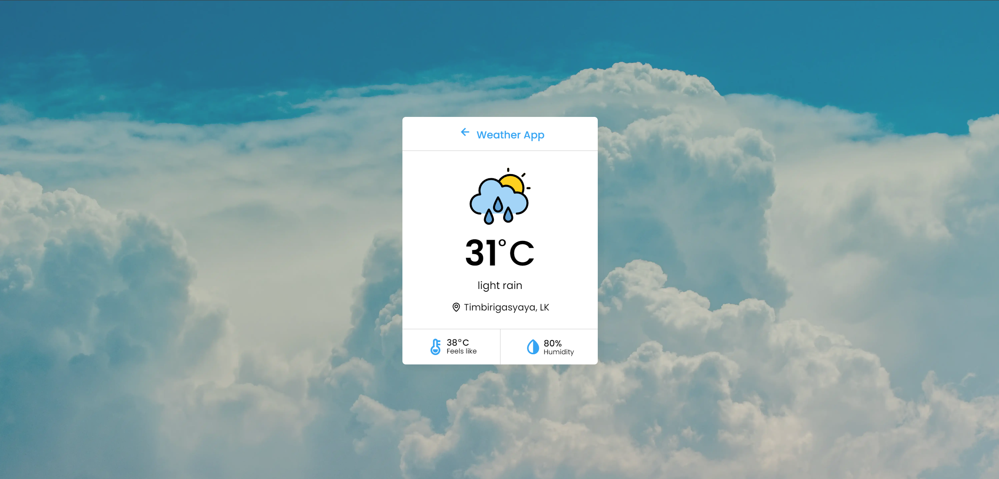

# Weather Web App

<h4> <a href=https://weather-web-app-60162f.netlify.app/>View Demo</a>  ·  <a href="https://github.com/buddhirangana/Weather Web App/blob/master/README.md"> Documentation </a>  ·  <a href="https://github.com/buddhirangana/Weather Web App/issues"> Report Bug </a>  ·  <a href="https://github.com/buddhirangana/Weather Web App/issues"> Request Feature </a> </h4>

